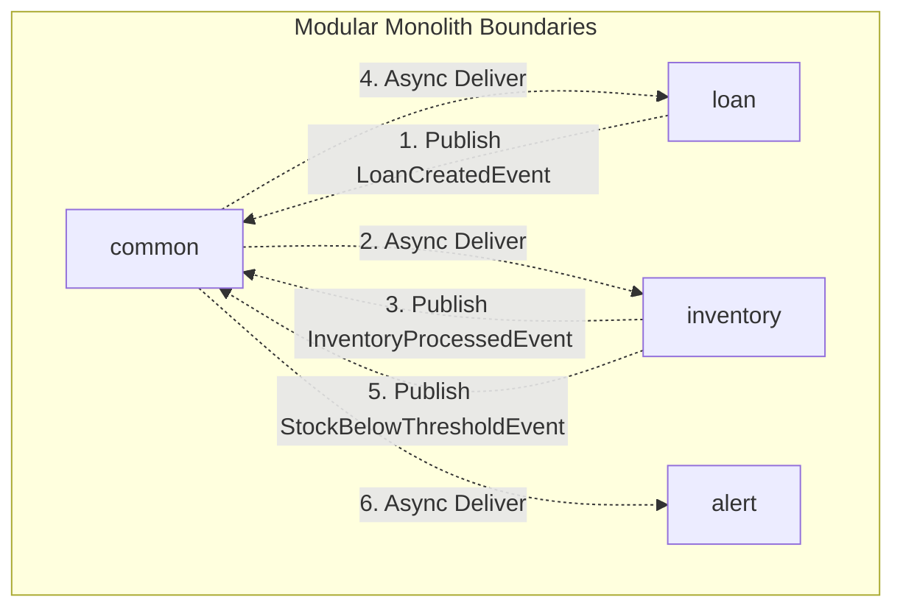
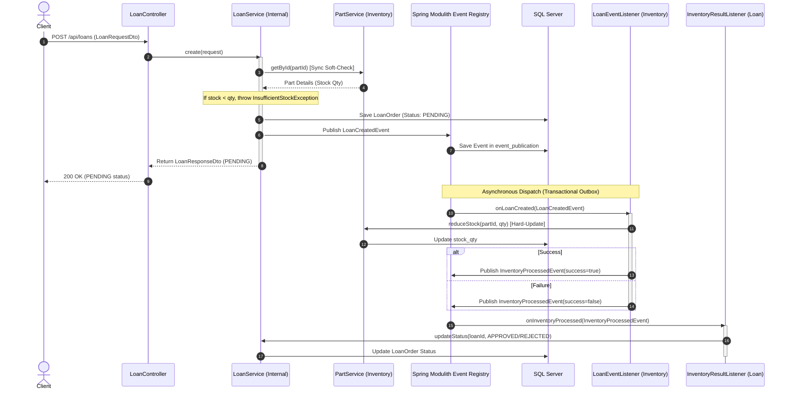

# Spring Modulith & Clean Architecture Loan Management System

A highly resilient, modular backend system built on **Spring Boot 4.0.6 (Java 25)**, **Spring Modulith**, and **Microsoft SQL Server (MSSQL)**. This application implements **Clean Architecture** principles to manage loans and inventory with high reliability and low latency.

---

## 📌 Architectural Overview

This project is built as a **Modular Monolith** using **Spring Modulith**. Instead of jumping straight to microservices—which introduces complex networking, latency, and deployment overhead—this project uses a modular monolith to maintain strong boundaries between domain contexts while running inside a single JVM.



### 🌟 Why This Architecture? (Why Spring Modulith?)

1. **Strict Logical Boundaries & Encapsulation**: 
   Spring Modulith enforces encapsulation at the package level. In this project, internal implementations are hidden inside `.internal` packages (e.g., `com.tdd.clean_architecture25.loan.internal`), while only the parent package (`com.tdd.clean_architecture25.loan`) exposes public DTOs and Interfaces. This prevents other modules from tightly coupling to internal databases, repository implementations, or services.
2. **Transactional Outbox Pattern (Event Publication Registry)**:
   When a loan is created, instead of performing blocking synchronous calls to update inventory, the system publishes a `LoanCreatedEvent`. Spring Modulith automatically intercepts this event and writes it to the `event_publication` table in the database in the *same database transaction* as saving the loan order.
   - If the transaction fails, everything rolls back.
   - If it succeeds, the event is guaranteed to be delivered. Even if the server crashes right after saving, Spring Modulith will republish outstanding events on restart.
3. **High Throughput via Asynchronous Execution**:
   Primary client requests (e.g., submitting a loan) complete instantly since heavy processing (deducting inventory, sending notifications, creating low-stock alerts) is handled in background workers, freeing up thread pools for high-concurrency requests.

---

## 🔄 The Hybrid Validation Flow

To prevent database clutter and provide quick client feedback, the application employs a **Hybrid Validation Flow** combining a **Synchronous Soft-Check** and an **Asynchronous Hard-Update**:



1. **Synchronous Soft-Check (Pre-Validation)**: When a loan request is received, the system queries the current stock levels synchronously. If stock is insufficient, it fails immediately with an `InsufficientStockException` (HTTP 400), saving DB writes and offering fast API feedback.
2. **Asynchronous Hard-Update (Inventory Reservation)**: If pre-validation passes, the loan is saved as `PENDING`, and a `LoanCreatedEvent` is published. Asynchronously, the `inventory` module deducts the actual stock.
   - If stock reduction succeeds, the loan status is promoted to `APPROVED`.
   - If a race condition occurred and stock is suddenly unavailable, the loan is updated to `REJECTED`, maintaining absolute eventual consistency.

---

## 🛠️ Technology Stack

- **Core Framework**: Spring Boot 4.0.6 (supported Java 25)
- **Modulith Library**: Spring Modulith 2.0.6
- **Database Access**: Spring Data JPA / Hibernate
- **Production Database**: Microsoft SQL Server (MSSQL)
- **Test Database**: H2 (In-memory MSSQL mode)
- **Boilerplate Reduction**: Lombok & MapStruct
- **Validation**: Jakarta Bean Validation

---

## 💾 Database Schema Setup

The core schema files are available in `scripts/sql/schema.sql`.

### Spring Modulith Event Registry Table (SQL Server)
Because this application is configured to run with `spring.jpa.hibernate.ddl-auto=none` in production to prevent unintended database mutations, the required Spring Modulith `event_publication` table must be created manually. 

Execute the following script on your SQL Server instance:

```sql
-- Create Spring Modulith Event Publication Table
CREATE TABLE event_publication (
    id UNIQUEIDENTIFIER NOT NULL,
    completion_attempts INT,
    completion_date DATETIME2,
    event_type VARCHAR(512) NOT NULL,
    last_resubmission_date DATETIME2,
    listener_id VARCHAR(512) NOT NULL,
    publication_date DATETIME2 NOT NULL,
    serialized_event VARCHAR(MAX) NOT NULL,
    status VARCHAR(255),
    PRIMARY KEY (id)
);
```

---

## 🚀 Getting Started

### 1. Prerequisites
- **Java JDK 25**
- **Microsoft SQL Server** running on `127.0.0.1:1433`
- Database named `clean_architecture`

### 2. Properties Configuration (`src/main/resources/application.properties`)
Update the properties to match your local SQL Server environment:
```properties
spring.datasource.url=jdbc:sqlserver://127.0.0.1:1433;database=clean_architecture;encrypt=false;
spring.datasource.username=sa
spring.datasource.password=Allrole123!
```

### 3. Build and Test
Run tests locally using H2 in-memory test database (which runs with dynamic schema creation):
```bash
./mvnw clean test
```

### 4. Running the Application
```bash
./mvnw spring-boot:run
```

---

## 🔌 API Documentation & Sample Request

### Create Loan
* **Endpoint**: `POST http://localhost:8005/api/loans`
* **Content-Type**: `application/json`
* **Sample Payload**:
```json
{
  "borrowerName": "Budi Santoso",
  "items": [
    {
      "partId": "550e8400-e29b-41d4-a716-446655440000",
      "qty": 2
    },
    {
      "partId": "f81d4fae-7dec-11d0-a765-00a0c91e6bf6",
      "qty": 5
    }
  ]
}
```

* **Sample Response (PENDING Phase)**:
```json
{
  "success": true,
  "data": {
    "id": "a3b90d2e-4b13-4cb2-83b5-7798a964f1c2",
    "borrowerName": "Budi Santoso",
    "status": "PENDING",
    "loanDate": "2026-05-19T16:00:00+07:00"
  }
}
```
*Note: In the background, the status will immediately update to `APPROVED` or `REJECTED` depending on stock levels.*
